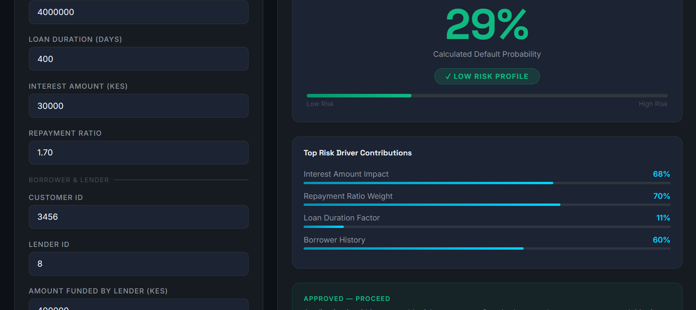
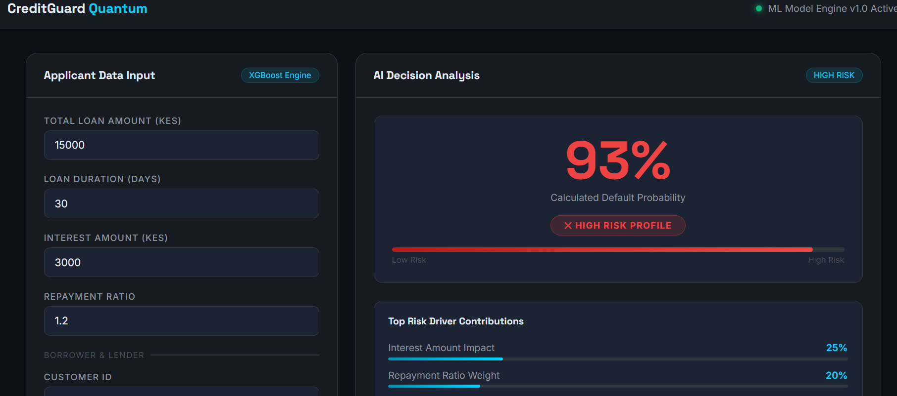

# CreditGuard Quantum — AI Credit Risk Predictor

> Built because bad lending decisions shouldn't come down to a gut feeling.





**Live Demo:** https://creditguard-xwxi.onrender.com

---

## The Idea Behind This

I built this because I was curious how does a lender decide who gets a loan and who doesn't?

The honest answer is that a lot of it is manual, inconsistent, and slow. A loan officer reviews an application, makes a judgment call, and moves on. Sometimes they get it right. Sometimes they don't. And when they get it wrong at scale across thousands of applications, the losses add up.

I wanted to build a system that looks at the numbers, finds the patterns, and gives the lender a clear answer before the decision is made. Not to replace the human, but to give them better information.

Hence CreditGuard.

## What It Does

When someone applies for a loan, a few things determine whether they will pay it back:

- **How much they are borrowing** — larger loans carry more risk
- **How much interest they are paying** — high interest relative to the loan often signals stress
- **How long they have to repay** — longer durations increase exposure
- **Their borrowing history** — have they done this before? Did it go well?
- **The repayment ratio** — if someone is expected to repay 2x what they borrowed, that is a red flag

CreditGuard takes all of that, runs it through an XGBoost model trained on 68,000+ real loan records, and returns a default probability in milliseconds. LOW, MEDIUM, or HIGH — with a recommendation attached.

## Who Can Use This

**Banks and SACCOs** can use it to automate the first layer of loan screening, flag the risky ones before they ever reach a loan officer's desk.

**Microfinance institutions** processing high volumes of small business loans can score every application instantly without hiring a team of analysts.

**Mobile lending apps** can call the API endpoint, get a score back in real time, and make a decision before the user even puts their phone down.

**Credit bureaus** can add a predictive layer on top of existing credit history to make their data more actionable.

The API is live. It takes a JSON payload, scores it, and returns the result. That is all it needs to do to be useful.

## Model Performance

| Model | ROC-AUC | Default Recall |
|-------|---------|----------------|
| XGBoost | 0.9962 | 95% |
| Random Forest | 0.9940 | 92% |
| Logistic Regression | 0.9851 | 93% |

The model catches 95% of actual defaulters. The 5% it misses is the cost of doing business. The 93% it saves from bad decisions is the value.

The dataset was heavily imbalanced only about 2% of loans defaulted. I used SMOTE to fix that so the model actually learns what default looks like instead of just predicting everyone repays.

---

## Stack

- **XGBoost** for the model — fast n accurate
- **FastAPI** for the backend 
- **Vanilla JS** for the frontend 
- **Render** for deployment — free tier, auto-deploys on push.

---

## Run It Yourself

```bash
git clone https://github.com/HERNIQNESS/Credit-Risk-Prediction.git
cd credit-risk-project
python -m venv venv
source venv/Scripts/activate
pip install -r requirements.txt
uvicorn app.main:app --reload
```

Hit `http://localhost:8000` and you are in.

## Project Structure
credit-risk-project/
├── app/
│ ├── main.py # FastAPI backend
│ ├── templates/
│ │ └── frontend.html # Dashboard UI
│ └── static/
├── data/ # Raw and processed data
├── models/ # Saved XGBoost model
├── notebooks/ # EDA, cleaning, training, evaluation
└── requirements.txt

 This project sits at the intersection of financial risk, machine learning, and API design.


